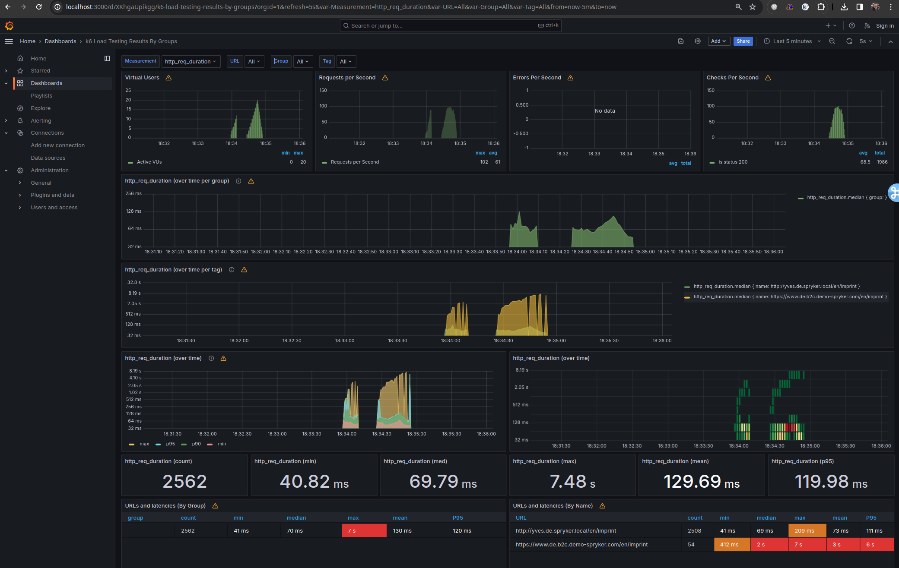
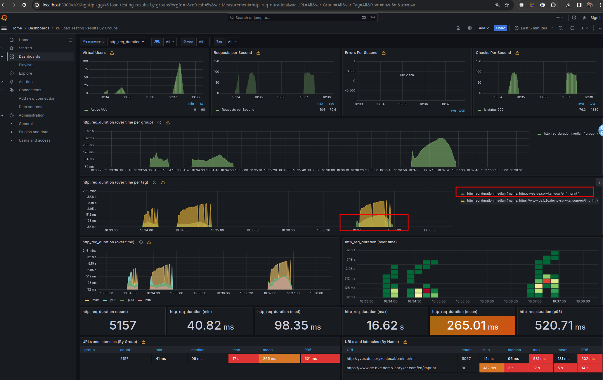

 - docker-compose up -d
 - add sprykerdeck ip to container /etc/hosts file by adjusting docker-compose.yml ("yves.de.spryker.local:192.168.86.141")
 - ./docker-run.sh scripts/script.js

Grafana:
   - http://localhost:3000
   - admin:admin
   - add datasource: http://influxdb:8086 -> database k6
   - import dashboard: [10660_rev1.json](10660_rev1.json)

Notes:
 https://github.com/grafana/xk6-output-influxdb#docker-compose

Dashboards:
 https://grafana.com/grafana/dashboards/?search=k6+load

